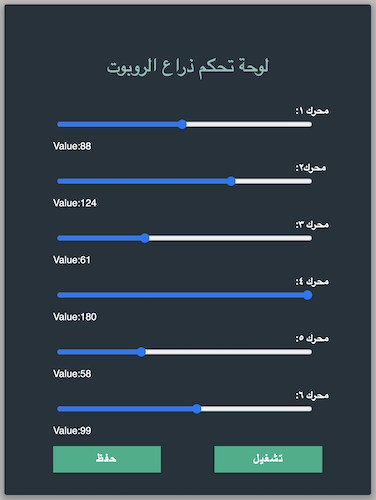

# Roboitc-arm-control-panel: 

## index.html & style.css:
  
there 6 motors slider to control the robotic arm's base, shoulder, Elbow, wrist, gripper and two buttons: 
1.  save 
2.  run

and the styling of the page, 6 sliders and buttons done in a separate file called style.css.

## script.js
  
  this is where i add some behavior to the slider by saving the 6 slider and range value into variables to use them in functions so the value of the slider is showing to the user. 

## connect.php

  I simply create a connection to my database "roboticArm" to store the values of the6 sliders and the state in "control_panel" table which has 7 attributes M1,M2,M3,M4,M5,M5 and ArmState. 

  once the user click the button "save"  the "ArmState" will be "OFF" and if it is "run" the "ArmState" will be "OFF" along with in both of the buttons the values of the sliders will be inserting into the database  

